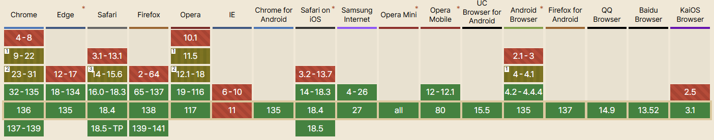

## WebP란?

**웹 페이지의 로딩 속도**가 **사용자 경험**과 **검색 엔진 최적화(SEO)**에 미치는 영향이 커짐에 따라, 더 효율적인 이미지 압축 기술이 필요해졌고, 이에 따라 Google은 2010년 차세대 이미지 포맷인 WebP를 만들었다.

<br/>

### 손실 압축과 무손실 압축

- **손실 압축(Lossy Compression)**
    - 데이터를 압축할 때 원본의 일부 정보를 영구적으로 삭제하여 파일 크기를 줄이는 방식
    - 주로 사람이 인지하기 어려운 정보(이미지의 미세한 색상 변화, 오디오의 비가청 영역 등)를 제거
    - **높은 압축률** → 파일 크기를 효과적으로 줄일 수 있음
    - 압축 과정에서 **품질 저하**가 발생할 수 있으며, 원본 데이터와 완전히 동일하게 **복원 불가능**
    - ex) JPEG, MP3, MPEG
- **무손실 압축(Loseless Compression)**
    - 데이터를 압축했다가 다시 풀었을 때, 원본 데이터와 완전히 동일하게 복원할 수 있는 방식
    - 손실 압축에 비해 **낮은 압축률**
    - 텍스트, 실행 파일, 금융 데이터 등 정확한 데이터 보존이 필요한 경우에 사용
    - ex) ZIP, PNG

<br/>

### WebP와 기존 이미지 포맷 비교

| 특징 | JPEG | PNG | GIF | **WebP** |
| --- | --- | --- | --- | --- |
| 손실 압축 | ✅ | ❌ | ❌ | ✅ |
| 무손실 압축 | ❌ | ✅ | ✅ | ✅ |
| 투명도 지원 | ❌ | ✅ | ✅ | ✅ (무손실) |
| 애니메이션 | ❌ | ❌ | ✅ | ✅ |
| 색상 표현력 | 24bit | 24bit+투명 | 8bit | 최대 24bit+투명 |

<br/>

### WebP의 장점

1. 뛰어난 압축 효율성
    - 동일한 화질의 이미지를 JPEG나 PNG에 비해 평균적으로 30% 정도 더 작은 크기로 저장할 수 있다.
2. 투명도 지원
    - 알파 채널을 지원하여, 배경이 투명한 이미지를 만들 수 있다.
3. SEO 및 사용자 경험 개선
    - WebP를 사용하면 이미지 파일 크기가 줄어들어 페이지 로딩 속도가 향상되므로, 사용자 경험 개선과 검색 엔진에서의 순위 상승을 기대할 수 있다.
4. 애니메이션 지원
    - GIF처럼 여러 프레임의 애니메이션을 지원하며, GIF보다 더 나은 압축률과 품질을 제공한다.
    - GIF는 256개의 색(8비트)만 지원하지만, WebP는 약 1,670만개의 색(24비트)를 지원한다.

<br/>

### WebP의 단점

1. 일부 구형 브라우저와의 호환성 문제
    - 그러나 최신 브라우저에서는 지원 걱정을 전혀 하지 않아도 되는 수준
    - 2025.05 기준 웹 브라우저의 96.81%가 WebP 포맷과 호환됨
    
    
    
    출처: https://caniuse.com/?search=webp
    
2. 애니메이션 이미지의 경우 GIF보다 CPU 사용량이 더 높다.
    - 압축 해제 시, GIF 대비 손실 방식의 경우 2.2배, 무손실 방식의 경우 1.5배의 디코딩 시간이 필요하다.

        > 📌 **압축률이 높아지면 인코딩/디코딩 시간이 늘어난다.**  
        > → 하위 호환성을 위해 원본 이미지로 fallback 시켜준다고 생각했을 때, 네트워크 부하를 줄이는 것과 압축시간을 트레이드 오프 관계로 볼 수 있다.

<br/>

## **WebP의 작동 원리**

WebP는 VP8 비디오 코덱의 프레임 압축 기술을 기반으로 만들어졌다. (**블록** 기반 코덱)

손실/무손실 압축 모두 `[예측 → 변환 → 엔트로피 코딩]`의 구조를 따른다.

### 손실 압축

1. **MacroBlocking**: 이미지를 macro block으로 분할 (JPEG과 유사)
2. **Intra Prediction**: macro block을 다시 4x4 sub block으로 나눈 후, 인접 블록의 정보를 활용해 예측값 산출, 예측값과 실제값의 차이만 저장 (PNG와 유사하지만, 예측 진행 방향이 다름)
3. **DCT:** 예측값과 실제값의 차이 데이터(잔차 데이터)를 주파수 성분으로 변환
4. **Adaptive Block Quantization:** 블록별로 압축 파라미터를 조정하여 이미지의 복잡도에 따라 효율적으로 비트를 분배 (이 과정에서 정보가 손실됨) 
5. **Entropy Coding**: JPEG는 허프만 인코딩 기법을 사용하지만, WebP는 부울 산술 인코딩 기법을 사용한다. 이 기법은 허프만 기법 대비 5~10% 더 높은 압축률을 가진다.

<br/>

### 무손실 압축

1. **Predictor (Spatial) Transform**: 인접 픽셀 값을 기반으로 현재 픽셀을 예측하고, 예측값과 실제값의 차이만 저장하여 중복 제거
2. **Color Transform**: 컬러 정보 압축 최적화 (RGB 채널 간 상관관계 줄이기)
3. **Color Indexing Transform**: 이미지 내 고유 색상 수가 적으면, 색상 인덱스 배열을 생성해 픽셀 값을 색상 인덱스로 치환
4. **LZ77 Backward reference**l: PNG와 마찬가지로, 이전에 등장한 픽셀 패턴을 참조해 중복 데이터를 효율적으로 저장 (WebP는 2D 거리값을 활용한 JZ77 변형 사용)
5. **Color Cache Coding**: 최근에 사용된 색상을 캐시에 저장해, 반복적으로 등장하는 색상을 효율적으로 인코딩
6. **Entropy Coding**: 최종적으로 LZ77-Huffman 기반의 엔트로피 코딩을 적용해 데이터 압축

<br/>

## **WebP 포맷 구조**

- **RIFF 기반 컨테이너 구조**
    - WebP는 **RIFF(Resource Interchange File Format)** 컨테이너를 기반으로 하며, 여러 개의 **청크**로 구성된다. 각 청크는 이미지 데이터, 메타데이터, 색상 프로필, 애니메이션 등 다양한 정보를 담을 수 있다.
- **RIFF 파일의 주요 청크**
    - `VP8`: 손실 압축 이미지 데이터
    - `VP8L`: 무손실 압축 이미지 데이터
    - `VP8X`: 확장 청크 (애니메이션, 알파, 메타정보 등 포함)

<br/>

## **WebP 변환과 최적화 방법**

- **변환 도구**
    - `webp`: WebP 공식 CLI 툴
    - Squoosh, TinyPNG 등 클라우드 기반 변환 서비스
- **품질(Q) vs 용량 Trade-off**
    - WebP를 손실 방식으로 저장하는 경우 품질 값을 설정해 주어야 하는데, 이 품질 값에 따라 결과물의 용량과 품질이 달라진다.
    - 품질 값이 낮을수록 용량이 작아지고, 품질 값이 클수록 용량 또한 커진다.
    - 해상도 조절 병행 시 용량을 더욱 감소시킬 수 있다.
- **Best Practice**
    - 이미지의 품질과 파일 사이즈(용량)을 고려한 가장 좋은 품질 값으로 정해진 것은 없다. **원본 이미지의 종류에 따라 적당한 값을 선택해야 한다.**
    - 대부분 50~80 사이의 값을 선택하면 문제가 없으나, **사람의 눈이 차이를 인식하지 못하는 정도까지만 품질 값을 낮추는 것이 현명하다.**
        - [다양한 품질 값에 따른 이미지 예시](https://kr.bandisoft.com/honeycam/webp/webp-quality/)

<br/>

## **WebP 지원 이슈 및 대체 전략**

- **브라우저 호환성**
    - 대부분의 최신 브라우저는 지원
    - 구형 브라우저는 미지원
- **대응 방법**
    - `<picture>` 태그 사용으로 포맷별 fallback 처리
        
        > **다중 포맷 파일 관리**의 부담은 WebP를 **자동 생성**하거나, **동적 변환**을 활용할 수 있다. 이를 통해 단일 포맷(JPEG)만 저장하고도 최적화된 이미지를 제공할 수 있다.
        > 
        
        ```html
        <picture>
          <source srcset="image.webp" type="image/webp">
          
        </picture>
        ```
        
    - 서버가 브라우저의 UA(User Agent)를 확인하여 적절한 포맷의 이미지를 제공
- **Polyfill**
    - 현재는 거의 필요 없음

<br/>

## **WebP 도입 시 고려사항**

- **포맷 혼용 전략**
    - 핵심 이미지는 WebP + fallback
    - 레거시 지원이 필요한 경우 JPEG/PNG 병행 운영
- **SEO 최적화**
    - `srcset`, `sizes`를 활용한 반응형 이미지 제공
    - 이미지 로딩 속도 향상 → **Core Web Vitals 개선**
- **퍼포먼스 측정**
    - 도입 전/후 **Lighthouse**, **PageSpeed Insights**로 측정
    - 실제 FCP, LCP 등 지표 개선 확인 가능

<br/>

## **WebP 이후의 대체 포맷**

- **AVIF**
    - AOM(Alliance for Open Media)에서 개발한 최신 이미지 포맷
    - 주로 동영상 스트리밍, 웹 이미지 최적화 등에서 **높은 압축률**을 목표로 설계되었다.
    - AV1 코덱(비디오 압축 기술)을 기반으로 이미지 압축 (손실/무손실 압축 모두 지원)
    - HDR(High Dynamic Range) 이미지 지원
        
        → 기존 SDR(Standard Dynamic Range)보다 훨씬 더 넓은 밝기와 색상 범위 표현 가능 
        
    - WebP보다 **더 높은 압축률**, 더 작은 용량 → 느린 인코딩 속도
    - 손실 압축 성능은 좋으나, **무손실 압축 성능은 PNG보다 떨어지는 경우도 많다.**
- **JPEG XL**
    - JPEG의 차세대 후속 포맷
    - **정지 이미지의 품질, 효율, 호환성**에 중점을 두고 설계되었다.
    - JPEG 이미지를 무손실 재압축해 용량을 20% 가량 더 줄일 수 있다.
    - 성능 우수, 품질 유지력 뛰어남
- WebP vs AVIF vs JPEG XL 비교 표  

    | 특징 | WebP | AVIF | JPEG XL |
    | --- | --- | --- | --- |
    | 손실 압축 | ✅ | ✅ | ✅ |
    | 무손실 압축 | ✅ | ✅ | ✅ |
    | 투명도 지원 | ✅ | ✅ | ✅ |
    | 애니메이션 | ✅ | ✅ | ✅ |
    | 색상 표현력 | 24bit+투명 | 최대 36비트 | 최대 32비트 |
    | HDR 지원 | ❌ | ✅ | ✅ |

<br/>

### 기타

- WebP가 JPEG을 대체할 정도로 확실한 성능적 이득이 없다?
    
    > 구글에서는 [WepP가 JPEG보다 30% 정도 용량 이득이 있다고 합니다.](https://developers.google.com/speed/webp/gallery1) 그러나 [MozJPEG](https://github.com/mozilla/mozjpeg) 등의 최적화된 JPEG를 사용하면 이 차이가 10% 미만으로 줄어들어 [별 성능 차이가 없게 됩니다.](https://siipo.la/blog/is-webp-really-better-than-jpeg)
    > 
    > 
    > (사실 JPEG는 “[미래에서 온 외계 기술 같다](https://people.xiph.org/~xiphmont/demo/daala/update1.shtml)”는 평을 받을 정도로 뛰어난 포맷입니다… 20년 후의 기술과 비빌 수 있을 정도로.) - https://c.innori.com/150
    > 

<br/>

### 참고자료
[웹용 이미지 형식 Google for Developers](https://developers.google.com/speed/webp?hl=ko)  
[WebP의 기반 기술](https://kr.bandisoft.com/honeycam/webp/webp-technology/)  
[How WebP works (lossly mode)](https://medium.com/@duhroach/how-webp-works-lossly-mode-33bd2b1d0670)  
[Lossy Compression](https://velog.io/@nurungg/WebP-Lossy-Compression)  
[WebP에 대해 알아보자](https://sightstudio.tistory.com/58)  
[JPEG XL과 조용한 차세대 이미지 포맷 전쟁](https://c.innori.com/150)